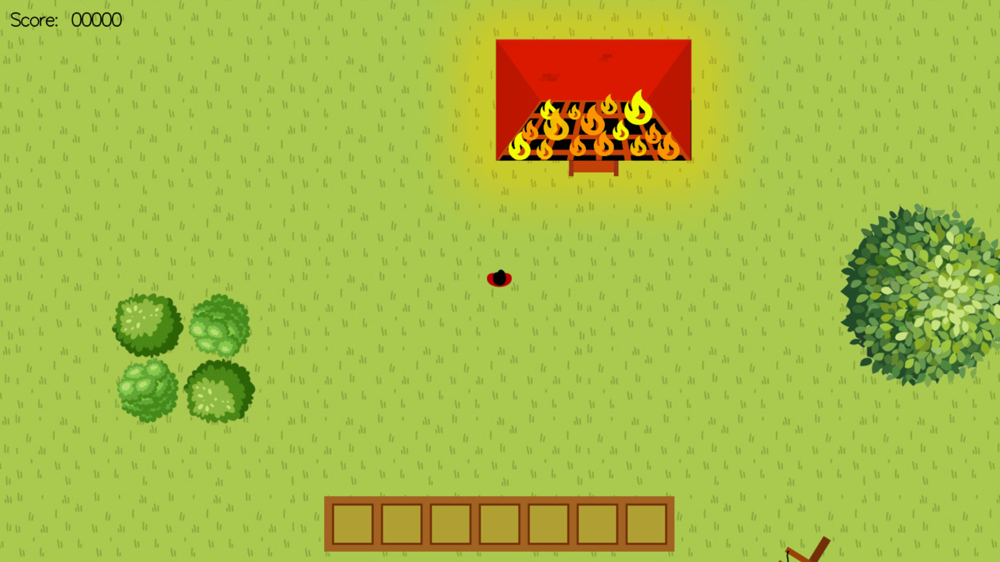
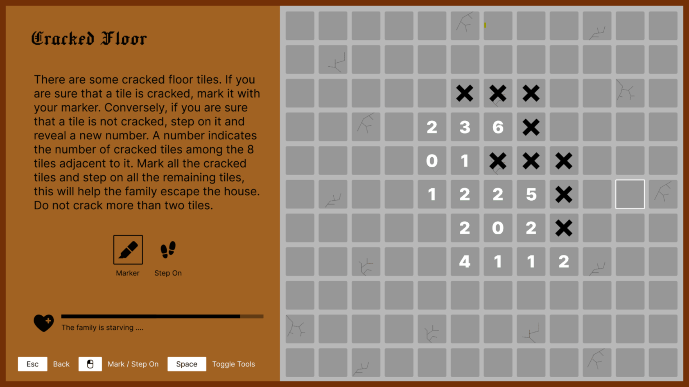
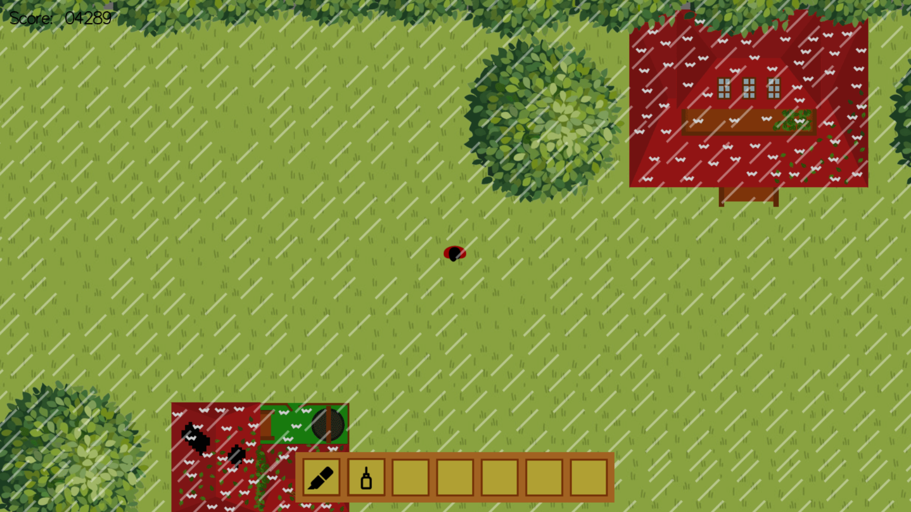
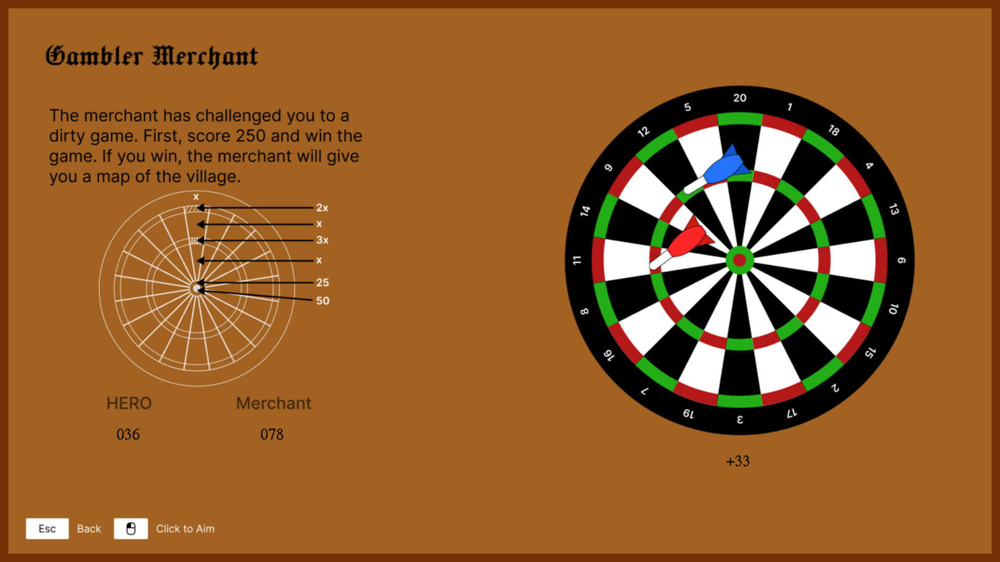

<h1>Rescue Rush</h1>

Rescue Rush is an university project. It is a open-world top-down game. You can explore the map and solve soo many interesting puzzles. On your journey, you have to help and rescue several villagers and solve different puzzles to do so. Are you ready?

Download the release version to play without worrying about the codebase:  
📁[Rescue Rush (Desktop)](https://drive.google.com/file/d/16ZBGpZPLVXfXm-NgDD1NQyyIdkUiaE7x/view?usp=sharing)  
📁[Rescue Rush (Laptop)](https://drive.google.com/file/d/1nDAkS6cCl_s9a6grUrn8eaXlHs0aFNp5/view?usp=sharing)

**Game Description:**  
A powerful cyclone struck a remote village late last night, unleashing fierce winds and torrential rains that raged for hours. The storm left behind massive devastation. Amid the ruins, one brave villager rose to the occasion to help save others. This game takes you on a rescue journey through that villager’s perspective. Each person faces unique challenges, and every mission requires solving distinct, thoughtful puzzles to bring them to safety.  

  
  
  
  

**To dear developers:**  
This repository contains the code of the laptop version. If you want to download the codes and play it on pc, please change the variable `ratio` to `1` (can be found at the beginning of the file) in <ins>"iMain.cpp"</ins>. This hassle is here only because laptops have a default display zoom that changes the screen ratio. If you want to come back to the laptop version, set `ratio` to `0.8`. If your display zoom is anything else, set `ratio` to `1/display_zoom` to get the full experience.